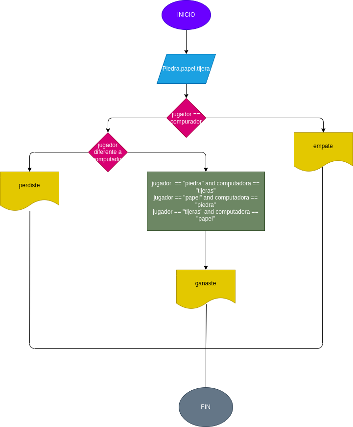

# piedra_papel_tijera
juego contra el ordenador sobre piedra, papel o tijera

# ANÁLISIS
ENTRADA

piedra
papel
tijera

PROCESO

jugador escoje igual al compuatdor
jugador piedra y computador tijera; jugador tijera y computador papel; jugador papel y computadora piedra
jugador piedra y ordenador papel; jugador tijera y computador piedra; jugador papel y computadora tijera

SALIDA

empate

ganaste

perdiste

# DISEÑO

# CONSTRUCCION